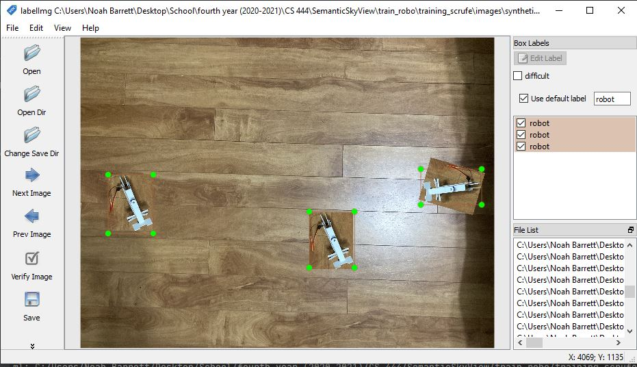
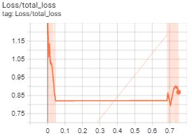

<h1> Question 1 </h1>
The localization of robot systems in a group or team configuration is an ongoing area
of research in robotics. There are many different ways we can try and address this problem.
The general schematic of localization requires some form of prediction of position, such as 
odometry (measuring how far and in which directions the system has moved) and a perceptual observation
such as raw sensor data or extracted features [1]. This project aims at utilizing cutting edge deep learning
techniques to accurately determine the position of robots in a group/team setting using only a single 
raw photo input feed and deep learning. 

Object detection identifies objects as axis-alligned boxes in an image [2]. This project will fine-tune several highly effective object detection deep learning models to determine the most effective
model for the problem at hand. Due to timing, only one prototype robot exists for the system of which this model is to be used on 
in the future. Because of this a synthetic dataset had to be created to train on. The workflow of this project is as follows:

*  Data Creation
    *  synthetically generate dataset
    *  annotate dataset
    *  convert annotated dataset to tf consumable dataset (.tfrecord format)
*  Model Selection
    *  select models from the tf model zoo, we want the fastest possible inference that is sufficiently accurate
    *  configure model pipelines for each downloaded pre-trained model
    
*  Training 
    *  train all selected models 
    *  select models to further tune based on their out-of-box performance 
    *  configure hyperparameters in pipeline configuration to try to find best performance in selected models.

*  Analysis  
    *  A comparison of the different training methods, hyper parametrs, etc.
    *  compare training times of all models
    *  compare testing accuracies of all models
    *  compare inference time of all models
    
[1] http://www.cs.cmu.edu/~rasc/Download/AMRobots5.pdf
[2] https://arxiv.org/pdf/1904.07850.pdf

<h1> Question 2 </h1>
Although data collection is not a part of this project, I thought I would include how I created
my own dataset. The actual software used for the larger project this deep learning 
application is intended for will use actual images of a group of robots for training. Currently, only one prototype is 
printed and so it will be used to synthetically generate images containing multiple instances of the prototype;
this is done using the utlity script build_imgs.py. Using the application labelIMG, I was able to take the synthetic samples 
and annotate them very quickly. Transfer learning allows us to use a smaller datasets relative to training from scratch, and so the
creation of this dataset was feasible for this course project. Once we have the images annotated, we must then make them consumable by the pre-trained models. First
we make a label map, this is a file with the extension .pbtxt, it contains the labels associated with the annotations for
the created dataset. Next we will convert our data to a .tfrecord using the labelIMG generated annotations, raw images and the associated label_map, 
this will make the data consumable by a tf model. The benefit of using a tfrecord is that it is stored as binary, therefore it is much more quickly accessed
from disk. This allows for significant speedups in training time, compared to loading the data in non-binary format.

Pipeline for raw data -> tfrecord:
1. generate synthetic images using build_imgs.py
2. annotate images with labelIMG lab, cmd: labelIMG [path/to/images]
3. run split_xml_img.py to sort images and xml, cmd: python split_xml_img.py [path_to_image/xml_dir]
4. use detection_util_scripts utility functions to convert to csv, cmd: python generate_csv.py xml [path/to/xml] [output/path] 
5. use detection_util_scripts to convert csv to pbtxt, cmd: python generate_pbtxt.py csv [path/to/csv] [path/to/output]
6. take all generated files and produce a .tfrecord, cmd: python generate_tfrecord.py [path/to/csv] [path/to/pbtxt] [path/to/images] [path/to/output]
This process is shown in src/preprocess/build_dataset.sh. Please note that files not written by me are included in the api_scripts
folder just for ease of access. It is indicated at the top of each file if this is the case.

Each image has three instances of the robot, all of which are randomly perturbed on the backdrop. This dataset is not very 
complicated and should not be overly difficult for a good object detection model to learn on. The total number of samples is
125, these are all stored in two .tfrecord files one for training: train.tfrecord and one for testing: test.tfrecord. 

<h2> AUC </h2>

For this project, a table of AUC values are not included as for image data doesnt really benefit from looking at individual 
AUC values. Instead a pixelwise AUC is caluclated and plotted using a heatmap. The results from this plot shows the "hot points" 
which show the most predictive regions. This plot clearly outlines the generated nature of my dataset. We can see three seperate
clusters, a top, middle and bottom, cluster. This is representative of how the images were generated. Three objects were permutated along a specified chunk of the back drop.
So these three groupings are representative of the restricted areas imposed to prevent overlap of the instances. This may outline the shortcoming of this dataset, that the instances are not super 
distributed across the plane. Less definition would indicate more random placement of the objects, which in our case would be good. 
When this training pipeline is used on real data of several robots moving around the plane, it is expected that the dataset will display more
spatial randomness in the AUC pixelwise plot. This may indicate a more challenging task for the models of which will be trained on the 
real dataset. 

<h1> Question 3 </h1>
This project takes advantage of the Model Garden for Tensorflow, this is a collection of state 
of the art deep learning models. The Model garden contains many different models for different applications
of which were trained using very high amounts of computational power usually. This project will
focus on the models designed for object detection. This is known as the Object Detection modelzoo. 

<h2> Model Selection </h2>
As discussed above this project will consider different pre-trained models. We will download several models from
the TF2 Detection Model Zoo. An up to date list of all available models can be found on https://github.com/tensorflow/models/blob/master/research/object_detection/g3doc/tf2_detection_zoo.md
For this specific project, models with faster speed (ms) are chosen, as we are looking for a quick model and the actual task is trivial compared to the task of which is posed with the datasets 
they were benchmarked on. When using these models, the inputs are reduced to the indicated size. The speed measurement is the time taken
to complete one inference. COCO mAP is the mean Average Precision on the COCO dataset. Average precision can be different measures,
for example AUC, or IOU. IOU is the intersection of the union, this measures how much the prediction compares with the ground truth. 
For this particlar case, the COCO mAP is a measure of a range of IOU measures on the COCO dataset; this is a common benchmark for object
detection models. 

|    | model                           | input size   |   Speed (ms) |   COCO mAP |
|---:|:--------------------------------|:-------------|-------------:|-----------:|
|  0 | faster_rcnn_inception_resnet_v2 | 640x640      |          206 |       37.7 |
|  1 | CenterNet_Resnet50_V1           | 512x512      |           27 |       29.5 |
|  2 | ssd_resnet50_v1                 | 640x640      |           46 |       34.3 |
|  3 | EfficientDet_D0                 | 512x512      |           39 |       33.6 |
|  4 | ssd_mobilenet_v2                | 320x320      |           22 |       22.2 |

From these statistics it is clear there is a direct trade off between accuracy and inference time. This makes sense, as 
the more complex the model, the more it is able to have stronger predictions and also take longer to predict.

<h2> Model Configurations </h2>
<h3>Faster R-CNN </h3>

https://arxiv.org/pdf/1506.01497.pdf
The original Faster R-CNN architecture is composed of two modules: one for proposing regions and one for dectecting regions. 
In the original paper, a VGG net with ReLU activations is used for the first part of the network. The particular model 
used in this project utilizes an Inception Resnet v2. A key term in object detection is "anchors" this is the areas of which
potential objects are indicated within the network. This particular architecture has translation-invariant anchors, which 
allows for the probability of a object being correctly identified regardless of it's location in the image. For our case, 
the same instance occurs in many different regions of the image and so this is a good thing. 

Some notes on this particular configurations' training parameters:
l2_regularizer is set to zero so no regularization is performed through this. However, several data augmentation techniques 
are used. These include: random_adjust_hue, random_adjust_contrast, random_adjust_saturation, random_square_crop_by_scale. Due 
to the simple nature of the dataset at hand, it is likely that these techniques are a bit overkill. The preset optimizer is 
SGD with momentum, it also uses a warmup period to prevent the overshooting of minimums in the optimization process.

<h3> CenterNet </h3>
https://arxiv.org/pdf/1904.07850.pdf
This approach models the center point of the predicting bounding box and predicts keypoints around it, to provide a quicker
method of detecting objects. This approach differs from other approaches as it does not use the "sliding window approach", 
that is, it does not enumerate all possible object locations. Avoiding the enumeration of all possible locations allows for
a more lightweight detection system. Anchors are assigned based on location. This differs from other methods that use manual thresholds
and average box overlap. In general, the idea behind this model and hence the title of the paper is "objects as points", that is finding the central region of the 
object and extending the bounding box around that point appropriately. The orginal paper experiments with ResNet, HourGlass and DLA 
Architectures for keypoint estimation. The particular model used in this project is a "meta-architecture" 
of this the discussed paper's implementation with ResNet. 

Some notes on this particular configurations' training parameters:
We can note the "object as points" in the loss objects being used, l1 localization loss is used for the object detetion task 
and classification loss is implemented as a method to measure the accuracy of the proposed boxes. Data augmentation methods 
include: random_horizontal_flip, random_crop_image, random_adjust_hue, random_adjust_contrast, random_adjust_saturation, 
random_adjust_brightness, random_absolute_pad_image. For optimization, the Adam algorithm is used; cosine decay is used, in 
general there are different options for decay functions. This approach also uses a "warm" start, like the first described model. 

<h3> SSD </h3>

https://arxiv.org/pdf/1512.02325.pdf
SSD stands for Single Shot Detector, this is the use of one single deep neural network for the purpose of detection. The original
paper utilizes the VGG-16 network. The following networks are SSD's using different base-networks. 

<h3> EfficientNet SSD </h3>

https://arxiv.org/pdf/1905.11946.pdf
The special thing about EfficientNet that differentiates it from other CNNs is it's focus on simple and effective up-scaling
of the model size. Rather than just arbitrarily scaling up the architecture size, the author's focus on finding relationships
within the layers that optimize both efficiency and accuracy. EfficientNets are a family of architectures which were developed using
the methods described in the paper to find both efficient and accurate models. This project uses an EfficientNet SSD. 

Some notes on this particular configurations' training parameters:
Optimzation is performed using SGD with momentum, this also uses cosine decay. For data augmentation,random_horizontal_flip 
and random_scale_crop_and_pad_to_square is used. 

<h3> MobileNet SSD </h3>

https://arxiv.org/pdf/1704.04861.pdf
MobileNet is a family of models that are particularly useful due to their "light weight" nature. This is made possible by
the depthwise seperable convolutional layers used in their architecture. This project utilizes a SSD with the MobileNet 320x320
model as its base-network. 

Some notes on this particular configurations' training parameters:
Similar to most of the other models, SGD with momentum is used for optimization. A cosine decay learning rate is utilized 
as well. Data augmentation techniques include: random_horizontal_flip, and ssd_random_crop.

<h3> ResNet SSD </h3>

https://arxiv.org/pdf/1512.03385.pdf
The ResNet family of CNNs is very famous and well known for its capabilities in image-based tasks. The key component of the 
ResNets is the Residual Unit, this implements skip connections which allows residual information to be concatonated to different
points within the block. These networks range from deep to relatively shallow and show the power and cost associated with the 
increase of depth in ANNs. This project utilizes a SSD built with the ResNet-50 as it's base-network. 

Some notes on this particular configurations' training parameters:
Like the other models, SGD with momentum is used, with cosine decay. For data augmentation, random_horizontal_flip, 
and random_crop_image is used. 

Each model comes with it's own pipeline config file. This file manages different hyperparameters
about the data, model configuration and training methods. We will edit these files to make them suitable to 
our particular dataset. The main thing to change is the number of features, for this project there  is only one class
"robot" so we will change the number of features to 1. Next, batch size, because I am dealing with my machine, I will likely not be able to
use the same size of batches that were used in the original training process. All three models batch size are reduced to meet the capabilities of
the machine being used for training.
Another notable change in configuration, is to change the fine tuning method to detection, we want to be training a detector not a
classifier so we must set this to detection rather than classification. We must also tell the model where the labels, and tfrecords are at. 

<h2> Training </h2>
training is performed using the tf object detection api:
python model_main_tf2.py --model_dir=[path/to/model] --pipeline_config_path=[path/to/config]

The training process in this project is a "finetuning" of the pretrained models. Because we are training complicated and deep models it can take 
a considerable amount of time to train, even if we are just "fine-tuning". Thanks to the TF Object Detection API, using these very complicated and sizeable models is made very 
feasible and relatively intuitive. A major benefit of using tensorflow is the ability to easily monitor training progress in real time, using tensorboard. 
The tf object detection API takes care of performing tensorboard callbacks, and so we can simply monitor the training progress using tensorboard. Initially, it was attempted to fine-tune the models on my own machine, but very quickly ran into some OOM errors with the EfficientNet
and CenterNet models. So the entire training process was moved over to google colab. 

It is notable that for this project, the settings for the train session are stored in the pipeline.config file. For each training
session discussed below, the specific config file is stored in the directory containing the resultant checkpoints. The training.py
file is a wrapper that contains functions that performs the system calls necessary for training for the particular configuration. 
Each model can be found in ./data/training/models/{modelname}

<h3> Initial training of models </h3>
to get a feel for using the API I started training one model:
The first model trained was the SSD_MobileNet_v2_320x320. The intial training of this model resulted in loss: 2.381 -> 116658.328 (steps = 4700).
In the first attempt at training, the model's loss grew very high. After 4700 training steps it was found to be
stuck at a loss of about thirty to fourty thousand. This very high loss was discouraging. 

To try to reduce the loss I attempted a couple different things. 
Some changes to the configuration were made to try and continue to minimze this model at the resultant check point from the first train attempt. 
*  change postprocessing max predictions from 100 to 3. This particular dataset will always only have three robots so this hould reduce the number of 
incorrect predictions.
It was clear that this was not going to work as the model was still oscilating between a loss of 20,000 and 60,000. 
I decided to attempt to reduce the learning rate to hopefully prevent this major oscilation of loss. The change in learning rate was reduced as follows:

learning_rate_base: 0.800000011920929 -> 0.75
total_steps: 50000
warmup_learning_rate: 0.13333000242710114 -> 0.01
warmup_steps: 2000

this did not work so I attempted to reduce the learning rate further
learning_rate_base: 0.75 -> 0.7
total_steps: 50000
warmup_learning_rate: 0.01 -> 0.001
warmup_steps: 2000

This model was found to be very bad at the task at hand. After trying to further fine tune the model, it was very proven difficult 
to prevent the early convergence at such a high loss. Luckily, we have so many other models at our disposal we can simply set 
this one aside and try another one out. 
 
Next model attempted to fine-tune was CenterNet_Resnet50_V1_FPN_512x512 This model even with a batch size of 1 is too large 
to train on the free resources provided by google colab. This issue was actually due to the buffer size being too large and 
so was resolved by decreasing the shuffle buffer size. The reduction in buffer size will mean more latency in the training 
process compared to the models that can use the default buffer size of 2048, the reduction to 1000 does create noticeable 
training speed differences. This model along with other models that were intially deemed to large to train on colab were found
to perform significantly better than the SSD_MobileNet_v2_320x320 and so it was decided to try a out-of-the box train for 25 000
steps max with early stopping to compare the out-of-box results between models. The results are as follows:

<h3> Out of Box Training of Models </h3>
The first training session was done with purely out of the box settings for the above described models. For 
All train sessions and configurations associated with this can be found at ./data/training/models/{modelname}/out-of-box/

Intially these models were trained with a max of 25 000 steps, I manually stopped each model when I noticed that they were
oscilating for a significant amount of time. In future applications, early stopping should be implemented to remove this 
manual aspect of training. Using the statistics provided by the default callbacks in the api, tensorboard was used to decide
the best checkpoint for each model from a out-of-the-box train. If all these models were allowed to train for their entire time, 
it is likely that they would do much better, but due to the time constraints they ended early and this was used to determine
which ones should be further investigated. 

|    | model                           |   step | time     |   smoothed total loss |
|---:|:--------------------------------|-------:|:---------|----------------------:|
|  0 | faster_rcnn_inception_resnet_v2 |    999 | 19m 13s  |                0.4157 |
|  1 | CenterNet_Resnet50_V1           |   1600 | 20m 26s  |                1.524  |
|  2 | ssd_resnet50_v1                 |   8100 | 49m 5s   |                0.3138 |
|  3 | EfficientDet_D0                 |    999 | 45m 3s   |                0.8207 |
|  4 | ssd_mobilenet_v2                |    999 | 26m  46s |                0.8338 |

As we can see, the highest train time is associated with the lowest loss. This would lead one to believe that they all should
be run longer. But as said above, the models were stopped based on the decline of their loss values. In the plots below
we can see the oscilation occuring in the worse models and a more smoothed and defined curve in the better performing models.
The later indicates that further gains in accuracy are possible, this was noted in the selection of models to further fine-tune. 
If time was not a concern, the number of models to continue training would be chosen more liberally. The below plots are from
tensorboard and the logged training information for each train session. The .tfrecords containing this information are not 
included in this project as the are very large, (some nearly 10GB).

The table below shows all of the models top three confidence values in their predictions:

|conf|   centernet_resnet50 |   efficientdet_d0 |   faster_rcnn |   ssd_mobilenet |   ssd_resnet50 |
|---:|---------------------:|------------------:|--------------:|----------------:|---------------:|
|  0 |             0.426614 |          0.858055 |      0.946417 |         0.18385 |       0.792096 |
|  1 |             0.375578 |          0.845688 |      0.941685 |         0.18385 |       0.769063 |
|  2 |             0.239601 |          0.842971 |      0.883947 |         0.18385 |       0.728293 |

<h4> FasterRCNN </h4>
<h5> Training </h5>

We can see a nice decline in loss in this plot, it appears as though it will continue to 
go down with more time.

<h5> Inference </h5>

We see that the boxes predicted are actually pretty good, but the confidence could go up some. 

<h4> SSDResNet </h4>
<h5> Training </h5>

We see a steep downward direction in the curve, this indicates that the model will likely be
able to be further trained.

<h5> Inference </h5>

Same as FRCNN: We see that the boxes predicted are actually pretty good, but the confidence could go up some. 

<h4> SSDMobileNet </h4>
<h5> Training </h5>

<h5> Training </h5>

The loss is oscilating, it does not appear very promising. 

<h5> Inference </h5>

Here we can see that none of the predictions made the 0.30 threshold, so no boxes are shown. 
No boxes predicted.

<h4> EfficientDet </h4>
<h5> Training </h5>

From this loss, it is unclear wether the model will be able to become accurate enough.

<h5> Inference </h5>

The predicted boxes are terrible for this model.

<h4> CenterNet </h4>
<h5> Training </h5>

This loss actually looks fairly promising, although the loss is high with respect to the
other models with a descending loss. 

<h5> Inference </h5>

We see that only two boxes are predicted, they are both good, but there should be another prediction
made. 

<h4> Inference Sample Comparison </h4>

To visualize the performance of each model, the below images show the top 3 predicted boxes for 4 different samples. To 
visualize the certainty of each model the below plot can be used. Although we cannot heavily rely on 4 test images, this 
does provide good representation of the relative performance of the models. Every sample contains three robots and the goal is
to correctly clasify objects with as much certainty as possible. We see that the SSD MobileNet is very unsure as for the 100 predicted
boxes all have a certainty of below 20%. EfficientDet has a similar issue where it has a high certainty for all boxes, this is good in some cases
but here, we know there are in fact always only three objects; so in this case 100 "pretty certain" predictions is not very useful. 
We see that CenterNet has a more desirable distribution of prediction certainties, as there is a small amount of values that
are considerably higher than the rest; this could indicate that it is doing a better job at finding the specific robots. THe certainty
of these predictions are however not very good (sub 50%). Lastly, we see this small number of having high certainty in SSD ResNet50 and
Faster RCNN and very high certainties for those predicted values, this indicates that it is confidently predicted a small amount of objects.
This solidifies the indication that these two models will be bet to continue fine-tuning. 
 

<h4> Conclusion from loss and inference samples </h4>
The faster rcnn and ssd resnet50 v1 give the most promising results and so we will continue to try and fine-tune these two models. 

 
<h3> Fine-Tuning </h3>

Using the checkpoints from the initial training session, the selected models will be further refined. The original pipeline 
configuration can be found in the out-of-box directory within the model, the checkpoints found in thir dir are used to further 
tune the models. For this, only Faster R-CNN and ResNet SSD are used. THey were each trained for an additional 25 000 steps. 
All train sessions and configurations associated with this can be found at ./data/training/models/{modelname}/fine-tune/

The overall training results are as follows:

|    | model                           |   step | time   |   smoothed total loss |
|---:|:--------------------------------|-------:|:-------|----------------------:|
|  0 | faster_rcnn_inception_resnet_v2 |  25000 | 2h 23m |                0.0285 |
|  1 | ssd_resnet50_v1                 |  25000 | 2h 34m |                0.064  |

For this I will remove all data augmentation, because this problem is fairly simple, the augmentation
may actually be unnecessary, so first we will remove all data augmentation methods from both models and see how that helps. In
addition to the data augmentation being removed, we also increase the batch size from 1 to 2, to hopefully speed up training times. 
This actually proved to give very good results. With these small changes, the models being used are still essentially out-of-the-box.
In order to really customize the nature of the training, learning rate, loss functions, etc. should be tweaked. 

The table below shows all of the models top three confidence values in their predictions:

|conf|   faster_rcnn |   ssd_resnet50 |
|---:|--------------:|---------------:|
|  0 |      0.999984 |       1        |
|  1 |      0.999982 |       1        |
|  2 |      0.999945 |       0.999961 |

We see very high confidence levels. much higher than the last training session.

<h4> FasterRCNN </h4>
<h5> Training </h5>

We can see that the curve is overall descending, it approaches a very satisfying sub 0.03 accuracy. It does
oscialte back and forth a bit, but with smoothing, it is very clearly declining. 

<h5> Inference </h5>

The predictions look similar to the first training session results, but the accuracy is way higher. 

<h4> SSDResNet </h4>
<h5> Training </h5>

We see a steep downward direction in the curve, this indicates that the model will likely be
able to be further trained.

<h5> Inference </h5>

Same as the above model: The predictions look similar to the first training session results, but the accuracy is way higher. 

<h4> Inference Sample Comparison </h4>

This plot is good when comparing against other models it helps in understanding how they are doing in relation to each other and how distributed the
confidence levels are. With the above plot we see an almost abrupt distinguishment between high and low. This is good, it
means the models know exactly where each of the three robots are. Overall these two models appear to be doing a very good job at predicting the robots. But they are slow and so are not the best
solution possible to the problem at hand. More work should be done in finding faster, less memory instense models. 

<h1> Conclusions </h1>
This project shows the power of the generalizability of the models in the object detection API. Models used for a different
dataset were able to get very good results in a very short amount of time. This potentially could save time instead of having 
to train a model from scratch. We saw that the Faster RCNN and SSD ResNet 50 were the most effective in the experiments done in 
this project. With more time, the exploration of hyper-parameters could be done to determine an even better solution. 

Using the pre-trained object detectors for this problem may be overkill. These models are trained to classify 90 different 
objects in a range of different environments. My generated dataset does not vary nearly as much and is quite simple. A better
approach to this problem may have been to try and build a lightweight and simple object detection model. The process of 
learning the object detection API was time-consuming, it is very likely in the same amount of time, a simpler model could have
been developed. 

For the fine-tuning models, it is likely the models could be deemed "overfit" as they are very very accurate with the training set,
But the nature of this problem is not very diverse so it is likely that it is not overfit to the point that it will not work on
new overhead samples of the robots. A very prevelant problem with this project is time, these models take far too long to infer. 
For the actual problem of object localization, these are not functional at a real-time level. Although these techniques could be used
for non-real time object localization applications. Furthermore, to target this problem, models such as the SSD MobileNet could be further
explored. 

<h1>Project Details</h1>

<h2> code and object detection API </h2>
This project utilizes the tensorflow object detection API.  The python script ./src/training/object_detection_wrapper.py
contains wrapper functions to interface with the API's command line scripts. This wrapper is used in ./src/training/training.py and
./src/training/inference.py to reproduce the training sessions and inference outcomes in the project. The training and inference of 
the models requires the object detection API to be installed and can be run in the main.py file if wanted. 

<h3> ./src/preprocess </h3>
contains the files and instructions for rebuilding the created dataset: this process is outlined in ./src/preprocess/build_dataset.sh

<h3> ./src/training/ </h3>
contains all of the scripts for training and inference using the object detection API
The python script ./src/training/object_detection_wrapper.py
contains wrapper functions to interface with the API's command line scripts. This wrapper is used in ./src/training/training.py and
./src/training/inference.py to reproduce the training sessions and inference outcomes in the project. The training and inference of 
the models requires the object detection API to be installed and can be run in the main.py file if wanted. 

<h3> ./src/api_scripts </h3>
contains scripts from the API that are copied over in order to make using them easier and more
accessible. 

<h2> Data </h2>
<h3> ./data/inference </h3>
Contains images used for the inference part of the assignment

<h3> ./data/training </h3>
This is where all the *important data is stored.  
In this folder the train and test .tfrecords are stored. These files contain all the data that the models are trained and tested on. 

<h3> ./data/training/annotations </h3>
this folder contains the label map that is used in the training process

<h3> ./data/training/images </h3>
The rw data used to generate the tfrecords and also generate the dataset itself can be found here. 

<h3> ./data/training/pre-trained-models </h3>
The project contains the pretrained models, that are used for the initial fine-tuning of the models

<h3> ./data/training/models </h3>
Contains 5 different models, each of which have either one or two sub-directories. Each sub-directory contains a training experiment 
in which can be used for further training and inference using the object detection API.
